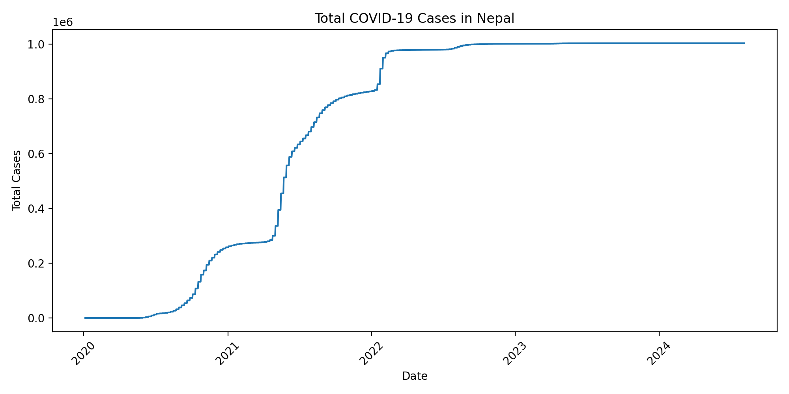
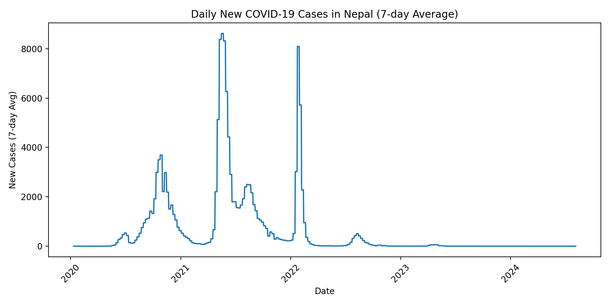
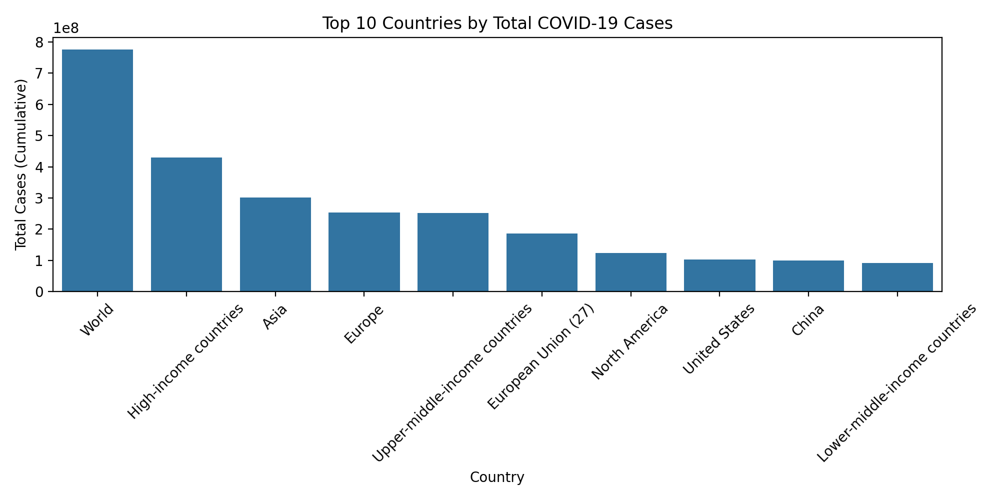
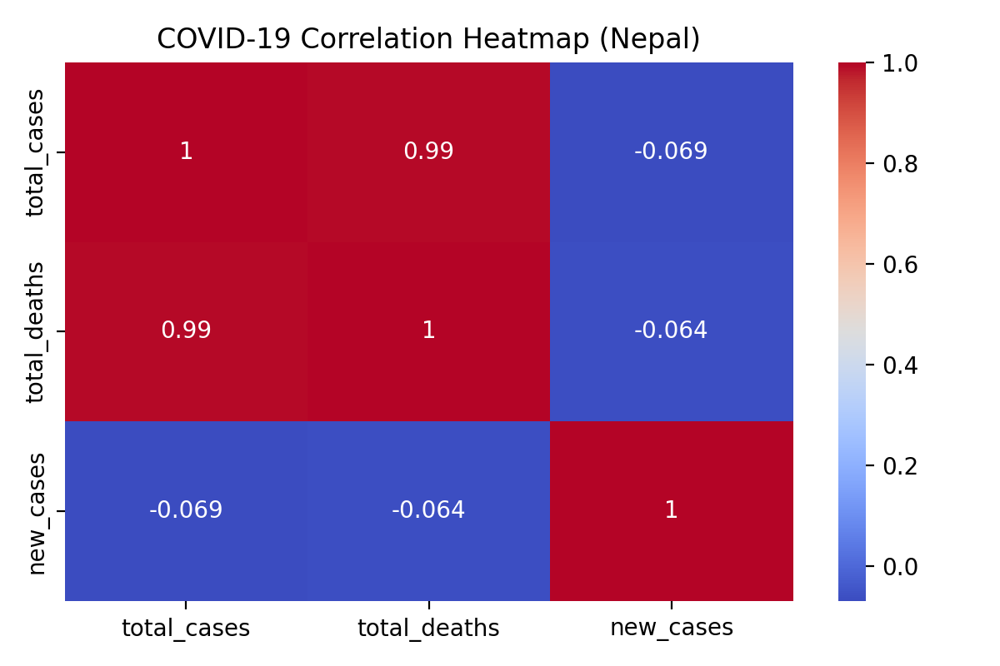

# Covid_data_visualization

COVID-19 Data Visualization using Python.  
This project analyzes COVID-19 data and generates visual insights using Pandas, Matplotlib, and Seaborn.

---

## 📌 Features

- Total COVID-19 Cases (Cumulative)
- Total COVID-19 Deaths (Cumulative)
- Daily New Cases
- Top 10 Countries by Total Cases (Latest Date)
- Correlation Heatmap
- Automatic output folder creation

---

## 📂 Project Structure

```
Covid_data_visualization/
│
├── data/
│   └── covid.csv
│
├── output/
│   ├── total_cases.png
│   ├── total_deaths.png
│   ├── daily_new_cases.png
│   ├── top10_countries.png
│   └── heatmap.png
│
├── main.py
├── requirements.txt
└── README.md
```

---

## 🛠 Requirements

Install dependencies using:

```
pip install -r requirements.txt
```

Or manually install:

```
pip install pandas matplotlib seaborn
```

---

## ▶️ How to Run

1. Download the dataset from **Our World in Data**
2. Place the dataset as:

```
data/covid.csv
```

3. Run the script:

```
python main.py
```

All graphs will be saved inside the `output/` folder.

---

## 📷 Output Graphs

### 📈 Total Cases (Cumulative)


### 💀 Total Deaths (Cumulative)


### 📊 Daily New Cases


### 🌍 Top 10 Countries by Total Cases


### 🔥 Correlation Heatmap


---

## 📊 Data Source

Dataset: https://ourworldindata.org/coronavirus

---

## 👨‍💻 Author

Sachin Jha

